# (STEP 20) PROJECT 10: LOAD BALANCER SOLUTION WITH NGINX AND SSL/TLS


By now we have learned what Load Balancing is used for and have configured an LB solution using Apache, but a DevOps engineer must be a versatile professional and know different alternative solutions for the same problem. That is why, in this project we will configure an *Nginx* Load Balancer solution.

It is also extremely important to ensure that connections to your Web solutions are secure and information is *encrypted in transit* – we will also cover connection over secured HTTP (HTTPS protocol), its purpose and what is required to implement it.

When data is moving between a client (browser) and a Web Server over the Internet – it passes through multiple network devices and, if the data is not encrypted, it can be relatively easy intercepted by someone who has access to the intermediate equipment. This kind of information security threat is called *Man-In-The-Middle (MIMT) attack.*

This threat is real – users that share sensitive information (bank details, social media access credentials, etc.) via non-secured channels, risk their data to be compromised and used by *cybercriminals.*

*SSL and its newer version, TSL* – is a security technology that protects connection from MITM attacks by creating an encrypted session between browser and Web server. Here we will refer this family of cryptographic protocols as SSL/TLS – even though SSL was replaced by TLS, the term is still being widely used.

SSL/TLS uses *digital certificates* to identify and validate a Website. A browser reads the certificate issued by a *Certificate Authority (CA)* to make sure that the website is registered in the CA so it can be trusted to establish a secured connection.

There are different types of SSL/TLS certificates – you can learn more about them below. 

https://blog.hubspot.com/marketing/what-is-ssl

https://www.youtube.com/watch?v=T4Df5_cojAs

https://www.youtube.com/watch?v=SJJmoDZ3il8


In this project you will register your website with *LetsEnrcypt Certificate Authority*, to automate certificate issuance you will use a shell client recommended by LetsEncrypt – *cetrbot.*

## Task

This project consists of two parts:

1. Configure Nginx as a Load Balancer

2. Register a new domain name and configure secured connection using SSL/TLS certificates

   Your target architecture will look like this:


   


## REGISTER A NEW DOMAIN NAME AND CONFIGURE SECURED CONNECTION USING SSL/TLS CERTIFICATES


  - Let us make necessary configurations to make connections to our Tooling Web Solution secured.
  
  - In order to get a valid SSL certificate – you need to register a new domain name, you can do it using any Domain name registrar – a company that manages reservation of domain names. The most popular ones are: *Godaddy.com, Domain.com, Bluehost.com., Ionos*


  - For the project we were going to user freenom.com , but it is currently down. 

    https://my.freenom.com/domains.php


     The screen below will be displayed.

    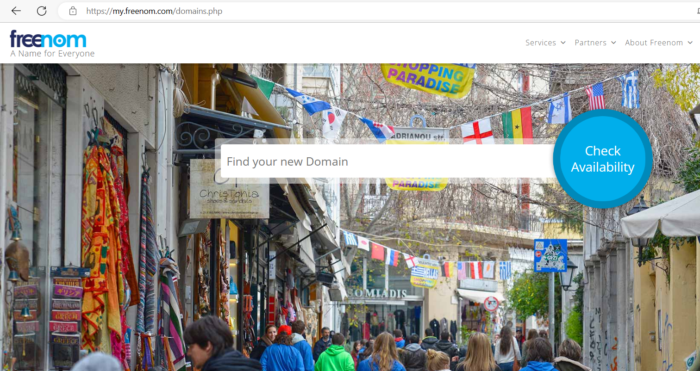

    Register a new domain name with any registrar of your choice in any domain zone (e.g. .com, .net, .org, .edu, .info, .xyz or any other)


  - We will therefore use Ionos which is a paid option. Go to the web browser and paste the link below.

    https://www.ionos.com/


 - Seach for availabity for *toolingysf*. It will tell you the available domain. Click Check.

   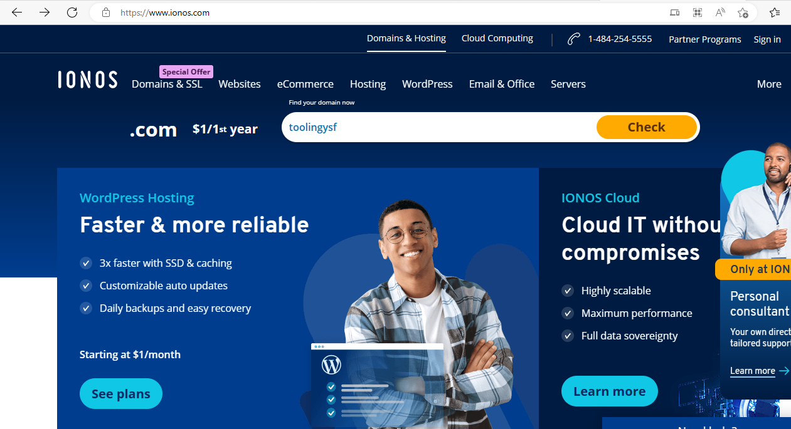


 - The screen below will be displayed. Click on Add to Cart for the 1 year subscription.


   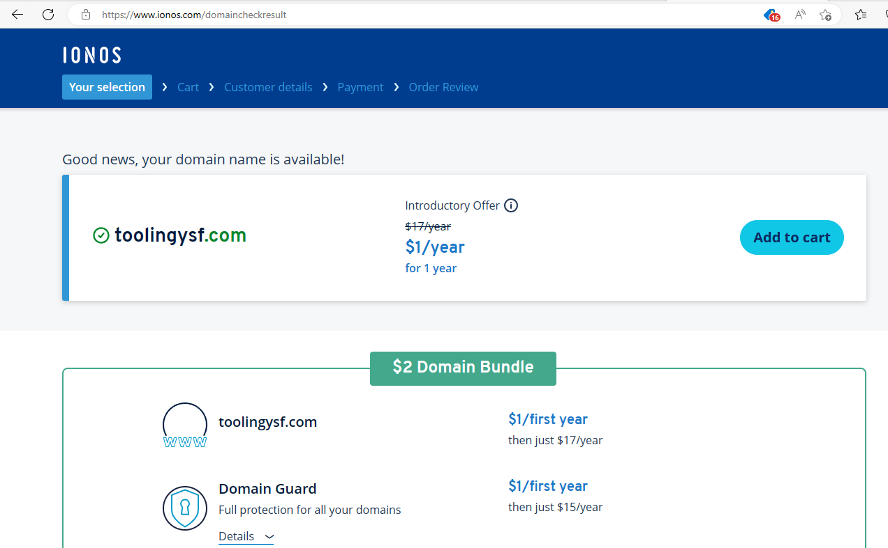


- Click on Continue.

  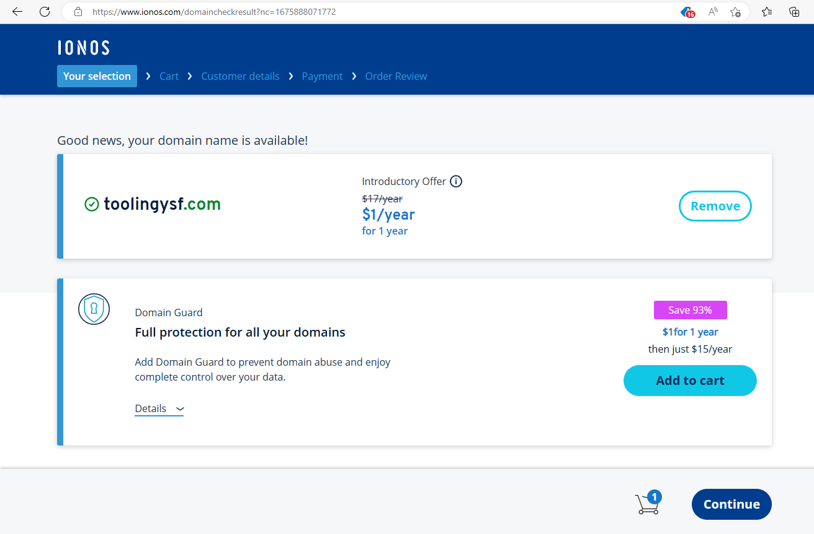

- Click Domain Only

  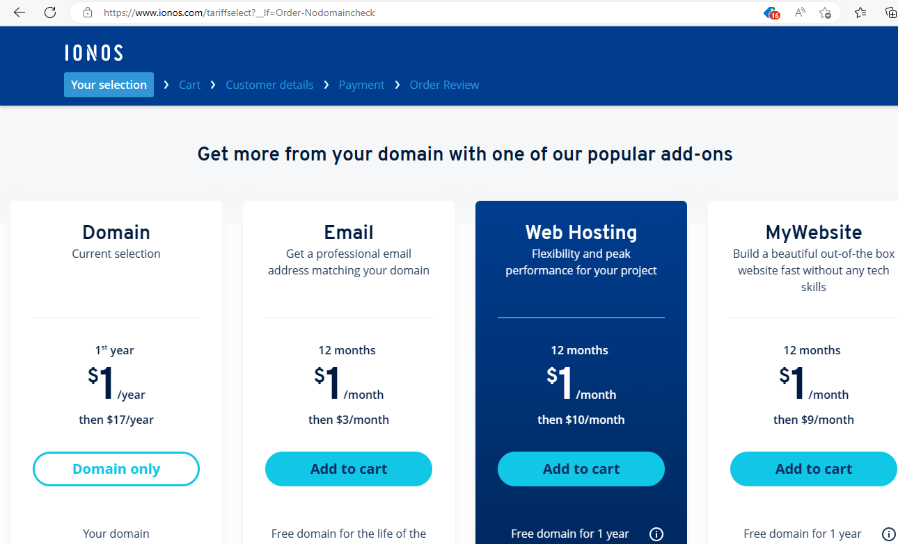

- Click Continue


  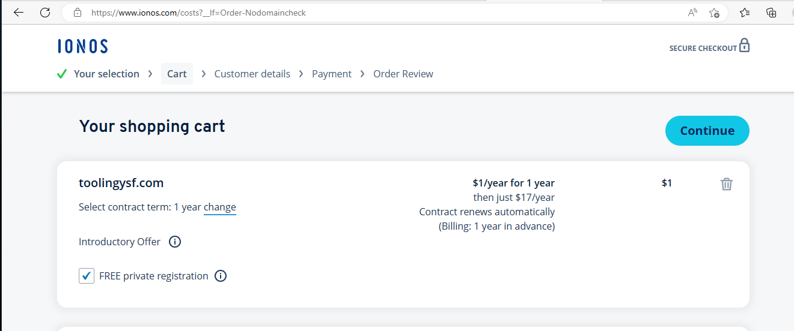


- Click Continue to checkout.

  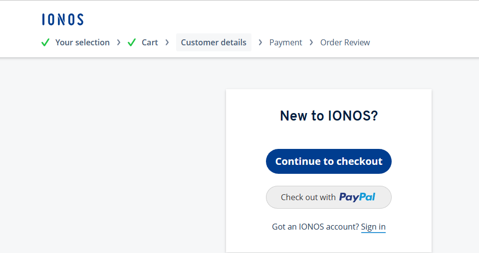

- Fill the Create New Account form and billing information.


  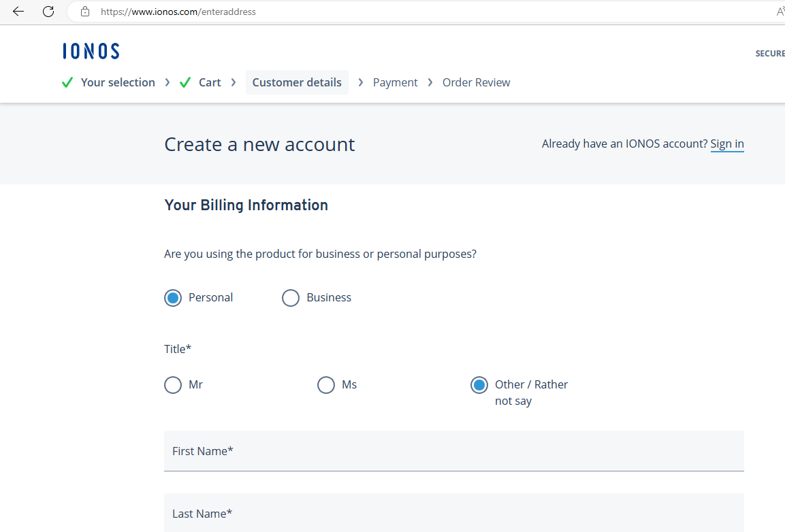


- After the order has completed, the screen below will be displayed. Check your email and complete the steps in the email.

  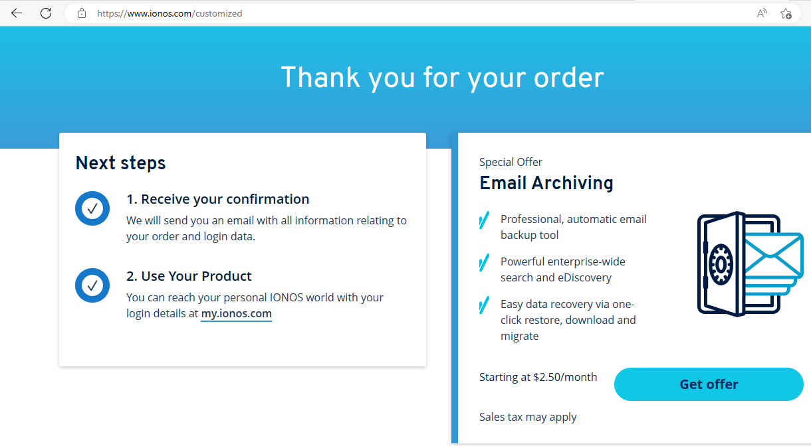


- Finally you will receive an email showing that the Domain has been successfully registered.


  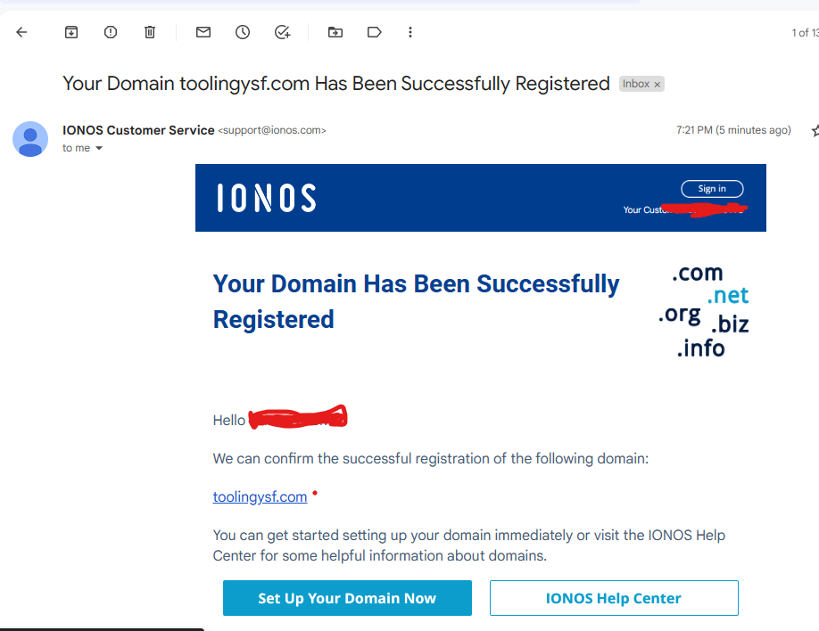

- Login to Ionos with your credentials that you were provided before.

  

- You will received another email to confirm your email.

-  on Doamin and SSL.

   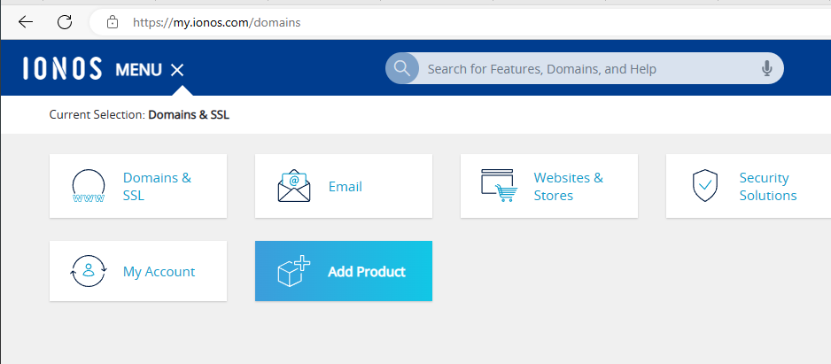


- The Domain will be displayed at the bottom.

  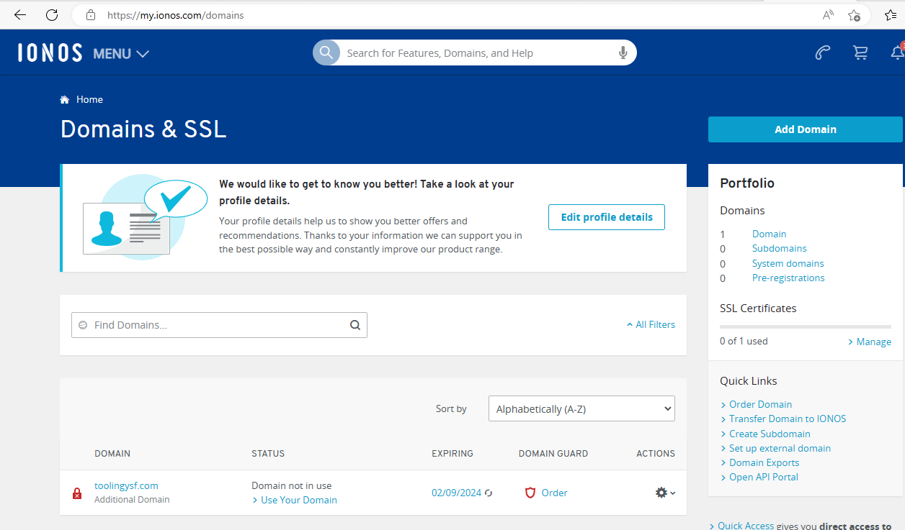


- Click on the Toolingysf and it will show that the Domain is Active.


  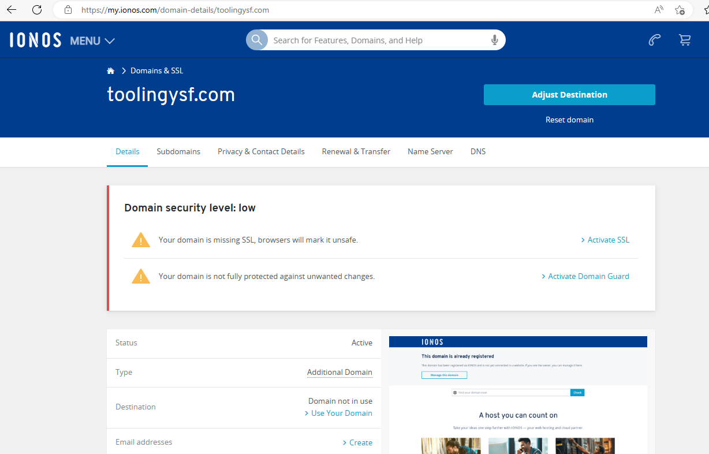


- Go to AWS page and search for Route 53 under Services.

  


- Click Create hosted zone.

  


- Fill the Domain Name , Tye as Public hosted zone and then click Create hosted zone.

  


- It will show that toolingysf.com was successfully created.

  

 - Go to Menu > Domains & SSL > Under Actions , click on Settings icon > Name Server.

   


- The screen below will be displayed.


  


- Click on Use custom name servers

  

- Copy and paste each of the Name Servers from AWS Route 53 page to each line on Ionos page.


  


- After that click Save.

  


- It will show that Name Servers have been successfully changed.

  


   This shows that our Route 53 and the toolingysf domain are connected.


## CONFIGURE NGINX AS A LOAD BALANCER

- You can either uninstall Apache from the existing Load Balancer server, or create a fresh installation of Linux for Nginx.

1. Create an EC2 VM based on Ubuntu Server 20.04 LTS and name it Nginx LB (do not forget to open TCP port 80 for HTTP connections, also open TCP port 443 – this port is used for secured HTTPS connections)


   


- To open Port TCP for Port 80 and TCP for Port 443 click on Security > Security groups > Edit Inbound Security. Add the two rules and Save rules.

  


- Copy the public IP address for Nginx LB; You will use it to create a record.

  18.217.14.224


- Go back to Route 53 as we now need to create a record for our domain name. click Create records.

  

- Click Create records.


  


- Paste the Public IP address for Nginx LB under values. Leave everything as defaulted and then click Create records.

  


- The screen below will show that a record has been created successfully. The first record at the top of the list shows the record that we have just created.


  


-  We will create another record for 'www'. Click Create records.


   

- Put "www" under Record name and the same Public IP address for the Nginx LB under Value, and then click create records.


  


-  The screen below will be diplayed showing that the record was successfully created. It will show as the forth record on the list.


   


- Now the load balancer with Route 53 and our Domain Name are now connected together.


- Connect the Load Balancer (Nginx) through the terminal.

  


2. Install and configure Nginx as a load balancer to point traffic to the resolvable DNS names of the webservers.

  - Update the instance and Install Nginx. Click Y when prompted while installing Nginx.


  
    `sudo apt update`

    `sudo apt install nginx`
  

     


    


    Enable Nginx.

    `sudo systemctl enable nginx`

    

- Start Nginx.

  `sudo systemctl start nginx`

  


- Check the status of nginx to ensure that it is running.

  `sudo systemctl status nginx`


  


- Open the default nginx configuration file

  `sudo vi /etc/nginx/nginx.conf`


  


3. Insert following configuration into http section. Note that the 2 IP addresses shown below are Private IP addresses for Web Server 1 and Web Server 2. The servername includes the domain and the web site (toolingysf.com www.toolingysf.com).

  ```
upstream web {
    server 18.217.65.38;
    server 18.191.61.143;
  }

server {
        listen 80;

        server_name toolingysf.com www.toolingysf.com;

        location / {
            proxy_set_header X-Forwarded-For $proxy_add_x_forwarded_for;
            proxy_pass http://web;
      }
  }

  ```

 - To perform the instructions above, follow the instructions below;

   Run;

   `sudo vi /etc/nginx/nginx.conf`

- The screen below will be displayed.

  

- Scroll down to http section;

- Copy and paste the section below under http. The two IP addresses are Private IP addresses for the two Web servers.


  


-  Delete all that was between the section of the file that you have added all the way to as shown below;

```
##
# Basic Settings
## 
```


Save and exit by :wq!:

-  Reload nginx.

   `sudo systemctl reload nginx`


4. We need to create a configuration for the reverse process sentence. 


-  Run the command below in Nginx LB server. We need to create a config file in nginx LB server.

   `sudo nano /etc/nginx/sites-available/load_balancer.conf`

   The screen below will be displayed.

   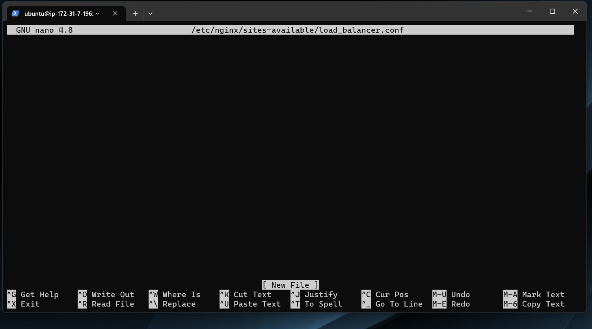

- Input the web server information. You will need to update it. Under upstream web, those are the two Private IP addresses for the web servers. I have used Project 7 web server 1 and Project 7 web 2.


```
upstream web {
    server 1 Private IP address;
    server 2 Private IP address;
  }

server {
        listen 80;

        server_name www.domain.com;

        location / {
            proxy_set_header X-Forwarded-For $proxy_add_x_forwarded_for;
            proxy_pass http://web;
      }
  }
```

- Our Domain  Name is : toolingysf.com


-  Below is the updated file. Copy and paste it to the nginx LB terminal.

  ```
upstream web {
    server 172.31.14.230;
    server 172.31.9.217;
  }

server {
        listen 80;

        server_name toolingysf.com www.toolingysf.com;

        location / {
            proxy_set_header X-Forwarded-For $proxy_add_x_forwarded_for;
            proxy_pass http://web;
      }
  }
   ```

  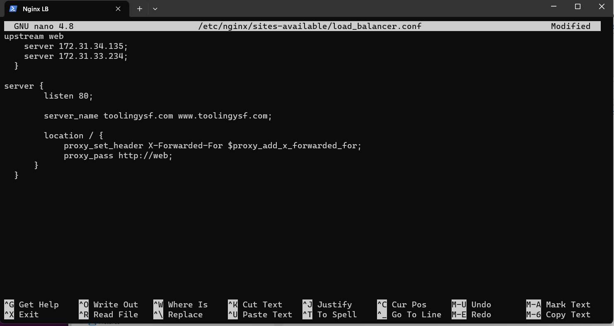


-  Control O to write.

   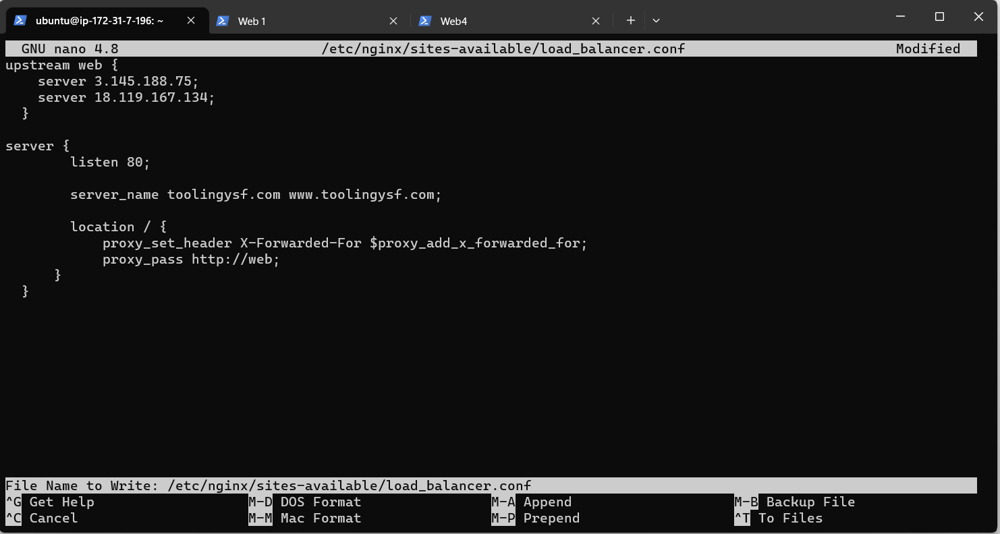


-  Press Enter.

   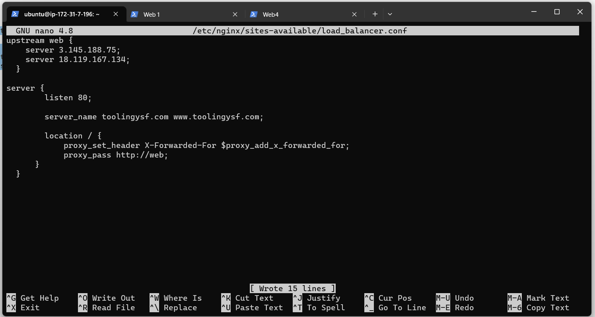


-  Control X to exit.

   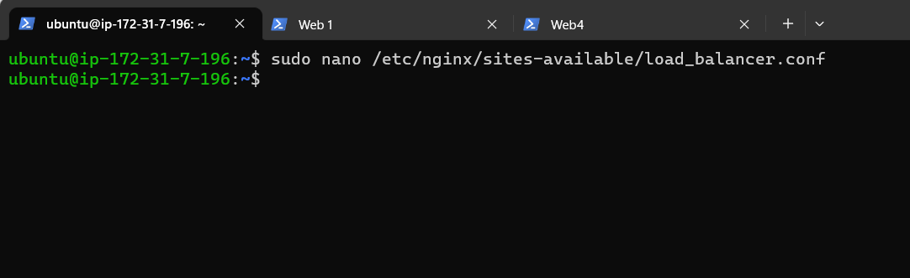


-  We need to remove the default site so that the reverse process will be redirecting to the new configuration file. 


   `sudo rm -f /etc/nginx/sites-enabled/default`

   

 -  Check if Nginx is susccessfully configured. It shows that the configuration of syntax is successful.

    `sudo nginx -t`


    


 -  Go back to nginx sites enabled by running the command below to change directory.

    `cd /etc/nginx/sites-enabled/`


 - 


 - Run `ls`. It should be empty. Our screenshot below is not correct because I took it after I linked the account and that is why we see the load_balancer.config.

   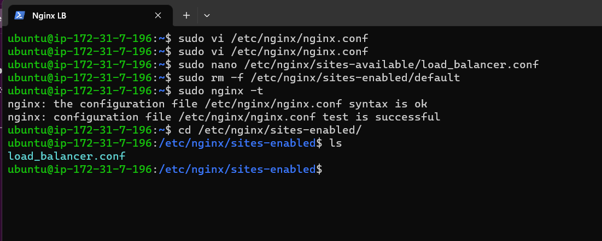


- We now need to link the load balancer config file that we just created in site available to site enabled.


   `sudo ln -s ../sites-available/load_balancer.conf .`

 - Then run `ls`

   


 - Run `ll` and it will show you again that it is linked.

   


 - Reload nginx.

   `sudo systemctl reload nginx`

   

 - Go back to the two web server and start httpd using the command below. check the status to ensure that they are up and running.

   `sudo systemctl start httpd`

   `sudo systemctl status httpd`

   

   


 - Lets go to our domain (toolingysf.com/login.php) it should provide the screen below. 


   


 - It shows that it is not secured. 

   


5. We need to secure the web page using Let's encrypt.

   -  Go back to Nginx terminal. Make sure you are in the original directory. You can use cd .. to go back to the original directory.

    - Install certbot

      `sudo apt install certbot -y`

      


   - Install a module that our certbot that cerbot will be using. It's like a dependency.

      Run;

     `sudo apt install python3-certbot nginx -y`


     


    - Check the systax and reload nginx.

      `sudo nginx -t && sudo nginx -s reload`


      

    -  To confirm that nginx is reloaded , you can check the status that it is running by the command below.


       `sudo systemctl status nginx`


       


     - Create a certificate for our domain to make it secured as it is unsecured currently.

     - Run the command below in the nginx terminal.

       `sudo certbot --nginx -d toolingysf.com -d www.toolingysf.com`

    - I got an error that the requested plugin was not installed. Run the command below to to fix the error by installing the nginx plugin.

    - If you have not run the command below then run it to ensure everything is upgraded.

      `sudo apt upgrade`

      `sudo apt-get install python3-certbot-nginx`


      

    - Rerun the command.

      `sudo certbot --nginx -d toolingysf.com -d www.toolingysf.com`


    - You will be prompted to enter email used for urgent renewals and security notices. Press Enter once you have input the email address.

      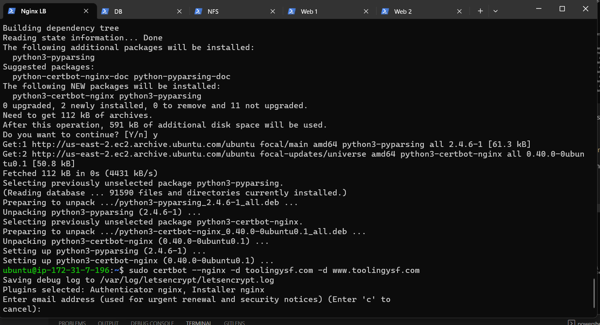


      

     - Press A to Agree to the terms.

       


    - Choose Y if you want to share your email address or N if you dont.

      

    - The screen below will be displayed.  

      


    - Select 1 to attempt to reinstall this existing certificate. This prompting is displayed beacuse I already attempted to install the certificate and ran into an error due to a mistake I made, otherwise you will be prompted to make a selection to install the certificate.

      

    - You will be prompted to choose whether to redirect HTTP traffic to HTTPS, removing HTTP access.

      


   - Select option 2. the screen below will show that you have successfully installed the certificates.

     


   - Now go back to the Tooling site and refresh your browser. It will change the Toolingysf.com site from unsecured to secured as shown below.


     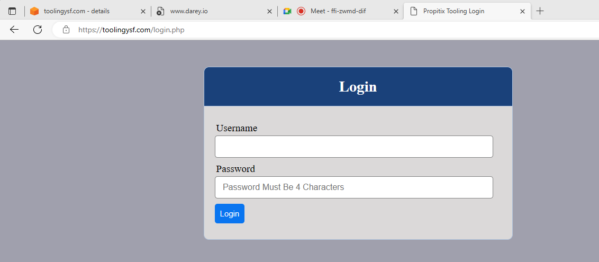


    - You can click on the lock to view site i formation, then connection secured. You can get the certificates information.

      


    -  You can login to the site with;

       Username:admin

       Pw: admin


        


    -  We need to create a cron tab.

       You can test renewal command in `dry-run` mode.

       `sudo certbot renew --dry-run`


       

      - It is a best practice to have a scheduled job to run "renew" command periodically. Let us configure a cronjob to run the command twice  a day.

     - To do so, let;s edit the crontab file with the following command;

       `crontab -e`


       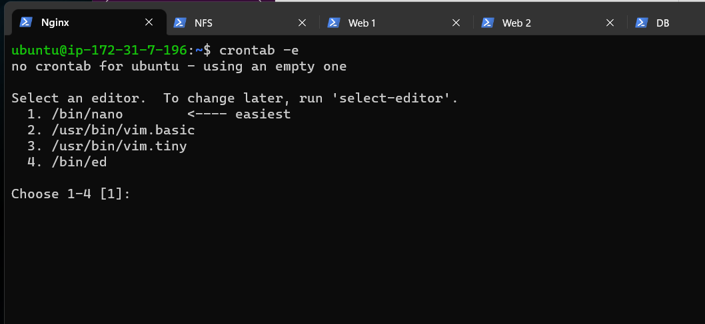


      - Select 1 and Enter.


        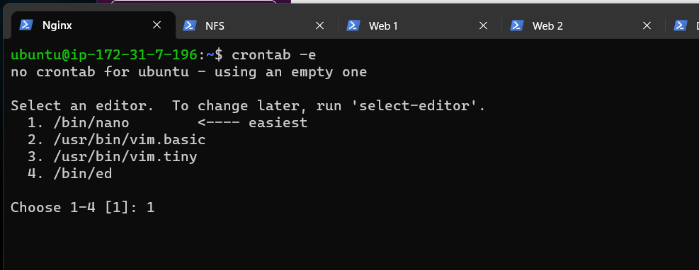


     - The screen below will be displayed.

       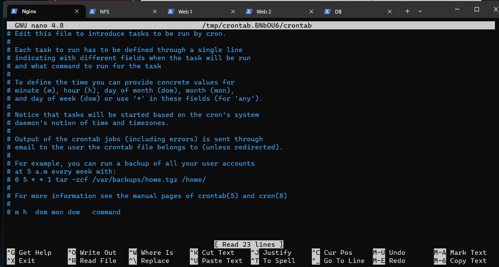

     - Scroll to the bottom of the file and you will see;

         m h dom mon dow  command

       ```
       m - month
       h - hour
       dom - day of the month
       mon - month
       dow - day of the week
       command - command you want to run
       ```


       Add the following line;

        `* */12 * * *  root /usr/bin/certbot renew > /dev/null 2>&1`

       The command means that the job will be running for all months, every day at 12th minute of every hour, everyday of the month, every month, and every day of the week.


       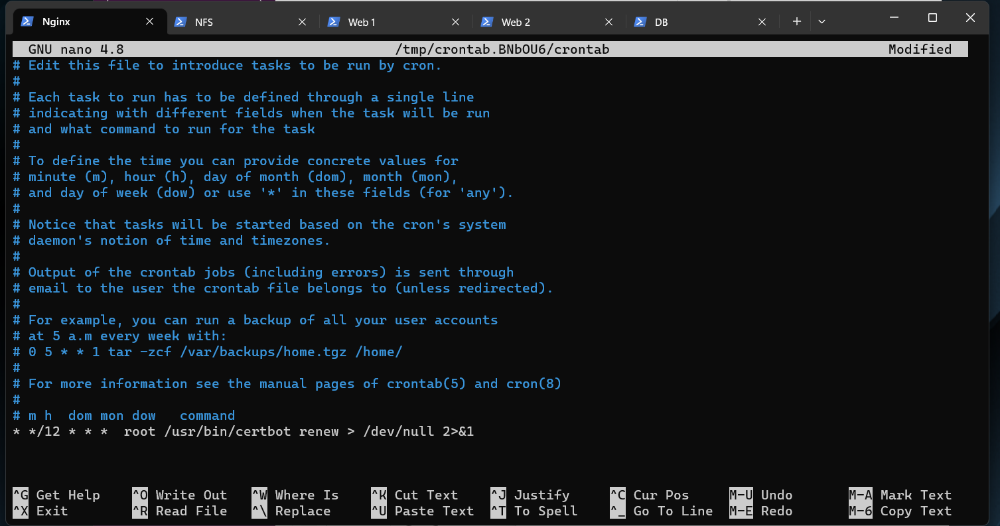

       Write out by Ctrl O , Enter and Exit by Ctrl X.

       The screen below will be displayed.

       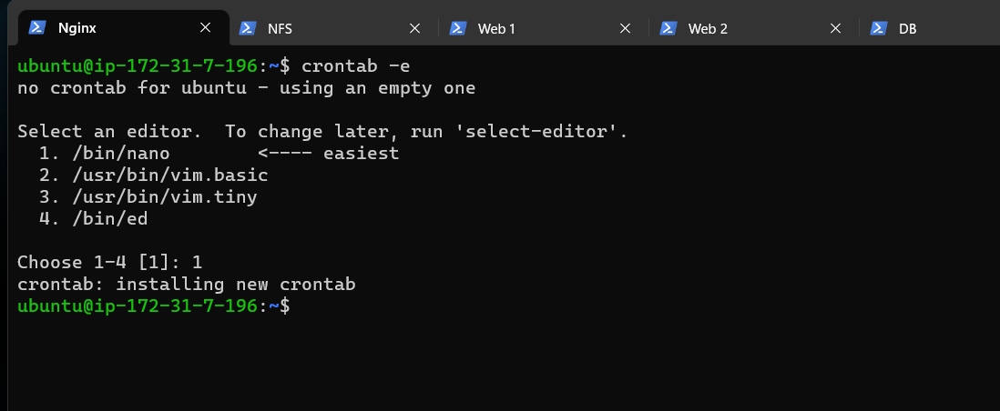


       Currently the website is up and running and secured.


       You can always change the frequency of the cronjob if twice a day is too often by adjusting schedule expression.


       Complete.


 


